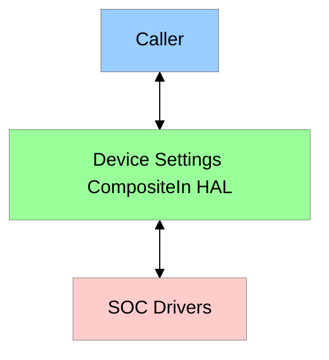
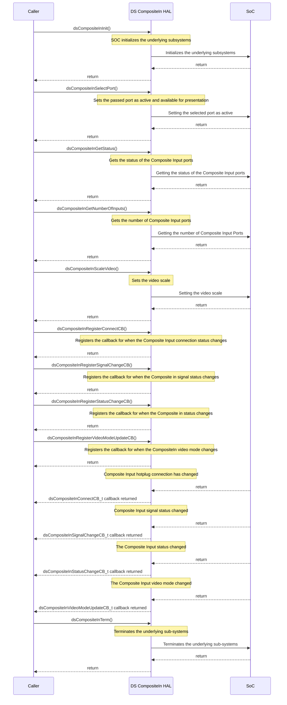

# Device Settings CompositeIn HAL Documentation

## Table of Contents

- [Acronyms, Terms and Abbreviations](#acronyms-terms-and-abbreviations)
- [Description](#description)
- [Component Runtime Execution Requirements](#component-runtime-execution-requirements)
  - [Initialization and Startup](#initialization-and-startup)
  - [Threading Model](#threading-model)
  - [Process Model](#process-model)
  - [Memory Model](#memory-model)
  - [Power Management Requirements](#power-management-requirements)
  - [Asynchronous Notification Model](#asynchronous-notification-model)
  - [Blocking calls](#blocking-calls)
  - [Internal Error Handling](#internal-error-handling)
  - [Persistence Model](#persistence-model)
- [Non-functional requirements](#non-functional-requirements)
  - [Logging and debugging requirements](#logging-and-debugging-requirements)
  - [Memory and performance requirements](#memory-and-performance-requirements)
  - [Quality Control](#quality-control)
  - [Licensing](#licensing)
  - [Build Requirements](#build-requirements)
  - [Variability Management](#variability-management)
  - [Platform or Product Customization](#platform-or-product-customization)
- [Interface API Documentation](#interface-api-documentation)
  - [Theory of operation and key concepts](#theory-of-operation-and-key-concepts)
  - [Diagrams](#diagrams)

## Acronyms, Terms and Abbreviations

- `HAL`         - Hardware Abstraction Layer
- `API`         - Caller Programming Interface
- `Caller`      - Any user of the interface via the `APIs`
- `CPU`         - Central Processing Unit
- `DS`          - Device Settings
- `SoC`         - System on chip
- `CompositeIn` - Composite Input

## Description

The diagram below describes a high-level software architecture of the CompositeIn stack.

DS `CompositeIn` `HAL` provides a set of `APIs` to initialize, query and set information about the Composite input ports such as getting the number of input ports, getting the current status of a selected input port, setting the video scale, selecting which Composite input to be selected as active and registering callbacks for asynchronous notifications.

## Component Runtime Execution Requirements

This interface must adeptly manage resources to prevent issues like memory leaks and excessive utilization. It must also meet performance goals for response time, throughput and resource use as per the platform's capabilities.

Failure to meet these requirements will likely result in undefined and unexpected behavior.

### Initialization and Startup

`Caller` must initialize this interface by calling `dsCompositeInInit()` before calling any other `APIs`. The `caller` is expected to have complete control over the life cycle of this module.

### Threading Model

This interface is not required to be thread safe. Any `caller` invoking the `APIs` must ensure calls are made in a thread safe manner. This interface is allowed to create internal threads for its operations without excessively consuming system resources. Any threads created by this interface must be handled gracefully and respective error codes must be returned if any corresponding `API` fails.

### Process Model

This interface is required to support a single instantiation with a single process.

### Memory Model

This interface is not required to allocate any memory. Any pointers created by the interface must be cleaned up upon termination.

### Power Management Requirements

Although this interface is not required to be involved in any of the power management operations, the state transitions must not affect its operation. e.g. on resumption from a low power state, the interface must operate as if no transition has occurred.

### Asynchronous Notification Model

This interface must support asynchronous notifications operations:

- `dsCompositeInRegisterConnectCB()` must facilitate asynchronous status notifications using the callback when the connection status of the callback `dsCompositeInConnectCB_t`. This callback must be used when the connection status when the Composite input port changes.
- `dsCompositeInRegisterSignalChangeCB()` must facilitate asynchronous status notifications using the callback `dsCompositeInSignalChangeCB_t`. This callback must be used when the Composite input signal status changes.
- `dsCompositeInRegisterStatusChangeCB()` must facilitate asynchronous status notifications using the callback `dsCompositeInStatusChangeCB_t`. This callback must be used when the Composite input status changes.
- `dsCompositeInRegisterVideoModeUpdateCB()` must facilitate asynchronous status notifications using the callback `dsCompositeInVideoModeUpdateCB_t`. This callback must be used when the Composite video mode changes.

 This interface is allowed to establish its own thread context for its operation, ensuring minimal impact on system resources. Additionally, this interface is responsible for releasing the resources it creates for its operation once the respective operation concludes.

### Blocking calls

This interface is not required to have any blocking calls. Synchronous calls must complete within a reasonable time period.

### Internal Error Handling

The `API` must return error synchronously as a return argument. This interface is responsible for handling system errors (e.g. out of memory) internally.

### Persistence Model

There is no requirement for the interface to persist any setting information. `Caller` is responsible to persist any settings related to this interface.

## Non-functional requirements

The following non-functional requirements will be supported by the module.

### Logging and debugging requirements

This interface is required to support DEBUG, INFO and ERROR messages. INFO and DEBUG must be disabled by default and enabled when required.

### Memory and performance requirements

This interface will ensure optimal use of memory and `CPU` according to the specific capabilities of the platform.

### Quality Control

- This interface is required to perform static analysis, our preferred tool is Coverity.
- Have a zero-warning policy with regards to compiling. All warnings are required to be treated as errors.
- Copyright validation is required to be performed, e.g.: Black duck, and FossID.
- Use of memory analysis tools like Valgrind are encouraged to identify leaks/corruptions.
- `HAL` Tests will endeavour to create worst case scenarios to assist investigations.
- Improvements by any party to the testing suite are required to be fed back.

### Licensing

The `HAL` implementation is expected to released under the Apache License 2.0.

### Build Requirements

The source code must build into a shared library for DS as `CompositeIn` module is a part of DS and must be named as `libdshal.so`. The build mechanism must be independent of Yocto.

### Variability Management

- Any changes in the `APIs` must be reviewed and approved by the component architects.
- Any modification must support backward compatibility for the generic operations like image upgrade and downgrade.
- This interface must return the dsERR_OPERATION_NOT_SUPPORTED error code, if any of the interface - `APIs` are not supported by the underlying hardware.

### Platform or Product Customization

This interface is not required to have any platform or product customizations.

## Interface API Documentation

`API` documentation will be provided by Doxygen which will be generated from the header file.

### Theory of operation and key concepts

The `caller` is expected to have complete control over the life cycle of the `HAL`.

1. Initialize the `HAL` `dsCompositeInInit()` before making any other `APIs` calls.  If `dsCompositeInInit()` call fails, the `HAL` must return the respective error code, so that the `caller` can retry the operation.

2. The `caller` can call `dsCompositeInSelectPort()`, and `dsCompositeInScaleVideo()` to set the needed information.

3. The `caller` can call `dsCompositeInGetNumberOfInputs()` and `dsCompositeInGetStatus()` to query the needed information.

4. Callbacks can be set with:
    - `dsCompositeInRegisterConnectCB()` - used when the CompositeIn port connection status changes
    - `dsCompositeInRegisterSignalChangeCB()` - used when the CompositeIn signal status changes
    - `dsCompositeInRegisterStatusChangeCB()` - used when the CompositeIn input status changes
    - `dsCompositeInRegisterVideoModeUpdateCB()` - used when the CompositeIn video mode changes

5. De-initialize the `HAL` using `dsCompositeInTerm()`

### Diagrams

#### Operational Call Sequence

