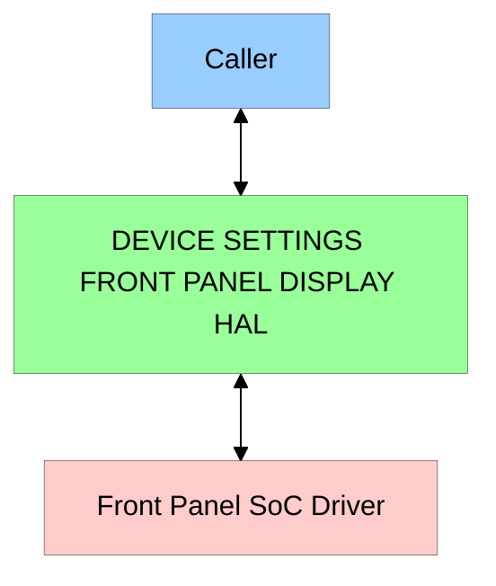
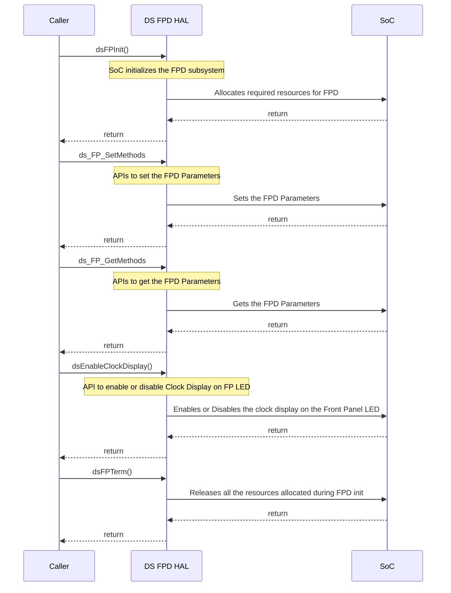

# Device Settings Front Panel Display HAL Documentation

## Acronyms, Terms and Abbreviations

- `DS`     - Device Settings
- `HAL`    - Hardware Abstraction Layer
- `API`    - Application Programming Interface
- `Caller` - Any user of the interface via the `APIs`
- `FPD`    - Front Panel Display
- `LED`    - Light-Emitting Diode
- `CPU`    - Central Processing Unit
- `SoC`    - System-On-Chip

## Description

The diagram below describes a high-level software architecture of the `DS` Front Panel Display stack.

This interface provides a set of `APIs` to facilitate communication to Front Panel `LED` Display `SoC` Drivers.

The brightness, color and text of Front Panel `LEDs` can be set or retrieved. This interface also provides `API` to enable or disable the specified discrete `LED` on the Front Panel Display.

## Component Runtime Execution Requirements

This interface must adeptly manage resources to prevent issues like memory leaks and excessive utilization. It must also meet performance goals for response time, throughput, and resource use as per the platform's capabilities.

Failure to meet these requirements will likely result in undefined and unexpected behavior.

### Initialization and Startup

`Caller` must initialize by calling `dsFPInit()` before calling any other `APIs`. `Caller` has complete control over the `FPD`.

### Threading Model

This interface is not required to be thread safe. Any `caller` invoking the `APIs` must ensure calls are made in a thread safe manner.

### Process Model

This interface is required to support a single instantiation with a single process.

### Memory Model

This interface is not required to allocate any memory.

### Power Management Requirements

The `FPD` `HAL` is not involved in the power management operation directly.
However, the `caller` will initiate the change in `LED` as part of power management handling.

The `caller` is responsible for driving `LED` status in accordance with power mode change.

### Asynchronous Notification Model

This interface is not required to have any asynchronous notification.

### Blocking calls

This interface is not required to have any blocking calls. Synchronous calls must complete within a reasonable time period. Any call that can fail due to the lack of response from the connected device must have a timeout period and the function must return the relevant error code.

### Internal Error Handling

All the `APIs` must return error synchronously as a return argument. `HAL` is responsible for handling system errors (e.g. out of memory) internally.

### Persistence Model

There is no requirement for the interface to persist any setting information. `Caller` is responsible to persist any settings related to the `HAL`.

## Non-functional requirements

### Logging and debugging requirements

This interface is required to support DEBUG, INFO and ERROR messages. INFO and DEBUG must be disabled by default and enabled when required.

### Memory and performance requirements

This interface is required to not cause excessive memory and `CPU` utilization.

### Quality Control

- This interface is required to perform static analysis, our preferred tool is Coverity.
- Have a zero-warning policy with regards to compiling. All warnings are required to be treated as errors.
- Copyright validation is required to be performed, e.g.: Black duck, and FossID.
- Use of memory analysis tools like Valgrind are encouraged to identify leaks/corruptions.
- `HAL` Tests will endeavour to create worst case scenarios to assist investigations.
- Improvements by any party to the testing suite are required to be fed back.

### Licensing

The `HAL` implementation is expected to released under the Apache License 2.0.

### Build Requirements

The source code must build into a shared library for Device Settings `HAL` as `FPD` is a part of Device Settings and must be named as `libdshal.so`. The build mechanism must be independent of Yocto.

### Variability Management

Any changes in the `APIs` must be reviewed and approved by the component architects. `DS` `FPD` must return the dsERR_OPERATION_NOT_SUPPORTED error code if any of the interface `APIs` are not supported by the underlying hardware.

### Platform or Product Customization

The configuration settings file (dsFPDSettings.h) for `DS` Front Panel can be used for adding platform specific configurations. The sample file is available [<b>here</b>](./frontPanelSettings_template.hpp "frontPanelSettings_template.hpp").

## Interface API Documentation

`API` documentation will be provided by Doxygen which will be generated from the header file.

### Theory of operation and key concepts

The `caller` is expected to have complete control over the life cycle of the `HAL`.

1. Initialize the `FPD` `HAL` using `dsFPInit()` before making any other `API` calls.  If the init call fails, the `HAL` must return the respective error code, so that the `caller` can retry the operation.

2. Once the `FPD` sub-system is initialized, `caller` can invoke `APIs` to control the Front Panel `LEDs`. The `FP` brightness, text, color, blink interval, `FP` `LED` state(ON/OFF), text scroll can be set or retrieved.

3. De-initialize the `FP` `HAL` using `dsFPTerm()`.

<u>Note :</u> The module would operate deterministically if the above call sequence is followed

The various `DS` `FP` `LED` states are as follows:

- Active
- Standby
- Connecting to WPS
- Connected to WPS
- WPS Error
- Factory Reset
- USB Upgrade
- Software Download Error

### Diagrams

#### Operational Call Sequence

